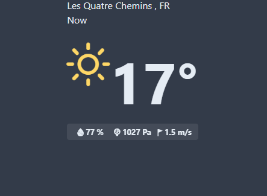

# miiniimaal-weather
A vanilla Javascript Chrome extension that show weather exploiting openweathermap API and browser Geolocation API.

Main parts:
- navigator.geolocation API
- Bootstrap 4
- Weather Icons 2.0.8
- jQuery v3.4.1

